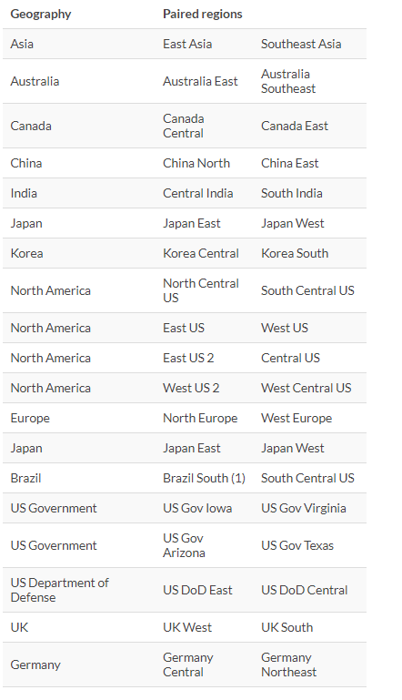
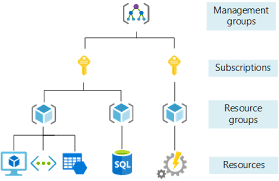

NOTE: if anyone is reading this I left out some of the objectives because i knew them well enough I saw no value in taking notes.

What are Azure Architectural Components

- Regions and availability zones
  - Regions
    - Regions are made up of one or more data centers in close proximity.
      - Regions are made up of multiple Availability zones
    - Provides flexibility and scale to reduce customer latency.
    - Preserve data residency with a comprehensive compliance offering.
  - Region pairs
    - At least 300 miles of separation between region pairs.
    - Automatic replication for some services.
    - Prioritized region recovery in the event of outage.
    - Update are rolled out sequentially to minimize downtime.
    - For DR reasons you would want to your Region pairs ready to go when ever you need them.
  - Availability zones
    - Availability Set
      - Availability Set Is a set of racks
    - Availability zones
      - Availability zones is a Data center
      - Provides protection against downtime due to data center failure.
      - Physically separates data center within the same region.
      - Each data center is equipped with independent power, cooling, and networking.
      - Connected through private fiber-optic networks.
    

- Subscriptions and resource groups

What are the core azure resources
- Compute
  - Azure compute is an on-demand computing service that provides computing resources such as disks, processors, memory, networking, and operating systems.
  - Examples
    - VM
      - Software emulations of a physical computer.
      -  Includes virtual processor, memory, storage, and networking.
      - IaaS offering that provides total control and customization.
    - App services
      - Azure app services is a fully managed platform to build, deploy, and scale web apps and APIs quickly
      - Works with .net, .net core, node.js, java, python or php
      - PaaS offering the enterprise-grade performance, security, and compliance requirements. 
    - Container instances
      - Azure container services
        - Azure containers are light-weight, virtualized environment that does not require operating system management, and can respond to changes on demand.
          - Azure container instances
            - A PaaS offering that runs a container in Azure without the need to manage a VM or additional services.
          - Azure kubernetes services
            - An orchestration service for containers with distributed architectures and large volumes of containers.
    - Windows virtual desktop 
      - Windows virtual desktop is a desktop and app virtualization that runs in the cloud.
        - Crete a full desktop virtualization environment without having to run additional gateway servers.
        - Publish unlimited host pools to accommodate diverse workloads.
        - Reduce cost with pooled, multi-session resources.
- Networking
  - Azure virtual network
    - Enables Azure resources to communicate with each other, the internet, and on-premises network.
  - VPN gateway
    - Used to send encrypted traffic between an Azure virtual network and an on-premises location over the public internet.
  - Azure express route
    - Extends on-premises networks into Azure over a private connection that is facilitated by a connectivity provider.
- Storage
  - GRS VS LRS
    - LRS means the data will only be housed in its own data center and will only be backed up in that data center
    - GRS means the data will be replicated in a different data center. adding a layer of protection for your data 
  - types of storage
    - Container storage (blob)
      - Optimized for storing massive amounts of unstructured data, such as text or binary data.
    - Disk storage
      - Provides disks for VM, applications, and other services to access and use.
    - Azure files
      - Sets up highly available network file shares that can be access by using the standard SMB protocol.
  - Ways to access storage ( you can switch between these are any time)
    - Hot ( most expensive)
      - Optimized for storing data that is accessed frequently.
    - Cool
      - Optimized for storing data the is infrequently accessed and stored for at least 30 days.
    - Archive (cheaper)
      - Optimized for storing data that is rarely accessed and stored for at least 180 days with flexible latency requirements.
- Databases
  - Azure Cosmos database
    - A globally distributed database service that elastically and independently scales throughput and storage.
  - Azure SQL database
    - A relational database as a service (DaaS) based on the latest stable version of microsoft SQL server database engine
  - Azure database for MySQL
    - A fully-managed MySQL database service for app developers
  - Azure database for PostgreSQL
    - A relational database service based on the open-source Postgres database engine.

What are the Azure resources?
- Azure resources are components like storage, virtual machines, and networks that are available to build cloud solutions.
- EVERYTHING IS A RESOURCE: storage, IP Address, VM. EVERYTHING.
- The main Azure resources are:
  - Virtual machines
  - Storage accounts
  - Virtual networks
  - App services
  - SQL databases
  - Functions

Key notes about SLA for a VM
- Single VM - 99.9%
- Availability Set - 99.95%
- Availability Zone - 99.99%

Resource group
- A resource group is a container to manage and aggregate resources in a single unit.
  - Resource can exist in only one resource group.
  - Resources can exist in different regions.
  - Resources can be moved to different resource groups.
  - Applications can utilize resource groups.

Azure resource manager
- The Azure resource manager (ARM) provides a management layer that enables you to create, update, and delete resource in your Azure subscription. 

Azure Subscriptions
- An Azure subscription provides you with authenticated and authorized access to Azure accounts.
  - Billing boundary
    - Generates separate billing reports and invoices for each subscription.
  - Access control boundary
    - Manage and control access to resources that users can provision with specific subscriptions.

Management Groups
- Management groups can include multiple Azure subscriptions.
- Subscriptions inherit conditions applied to the management group.
- 10,000 management groups can be supported in a single directory.
- A management group tree can support up to six levels of depth.

What is the Azure Marketplace?
Azure marketplace helps connect users with Microsoft partners, independent software vendors ans startups that are offering their solution ans services, which are optimized to run on Azure. 